# Skema Database — Website Desa Jatirokeh

Dokumen ini mendefinisikan struktur data untuk aplikasi Laravel 12 + Filament.
Target DBMS: **MySQL 8** (produksi) / **SQLite** (pengembangan lokal).

> Konvensi: nama tabel `snake_case` jamak, primary key `id` (BIGINT UNSIGNED auto-increment),
> setiap tabel punya `created_at` & `updated_at`. Tabel dengan data sensitif/historis memakai
> `deleted_at` (soft delete). Uang disimpan sebagai `BIGINT` dalam satuan **rupiah penuh** (bukan desimal)
> untuk menghindari galat pembulatan.

---

## 1. Peta Modul

| Modul | Tabel inti |
|---|---|
| Autentikasi & Hak Akses | `roles`, `users` |
| Konten (Berita/Pengumuman) | `categories`, `posts` |
| Transparansi APBDes | `budgets`, `budget_items`, `documents` |
| Bukti Pembangunan | `projects`, `project_photos` |
| Layanan Surat | `letter_types`, `letter_requests`, `letter_request_attachments`, `letter_request_logs` |
| Kependudukan (agregat) | `population_snapshots`, `population_breakdowns` |
| Profil & Pemerintahan | `officials`, `village_boundaries`, `institutions` |
| Potensi Desa | `potentials` |
| UMKM / Direktori Usaha | `businesses`, `business_products` |
| Galeri | `galleries`, `gallery_photos` |
| Aspirasi / Pengaduan | `aspirations` |
| Konfigurasi Situs | `settings` |
| Audit | `activity_log` (paket spatie/activitylog) |

---

## 2. Diagram Relasi (ERD)

```mermaid
erDiagram
    roles ||--o{ users : "memiliki"
    users ||--o{ posts : "menulis"
    categories ||--o{ posts : "mengelompokkan"

    budgets ||--o{ budget_items : "berisi"
    budgets ||--o{ projects : "mendanai"
    budgets ||--o{ documents : "melampirkan"
    budget_items ||--o{ budget_items : "sub-pos (parent)"
    budget_items ||--o{ projects : "merinci"
    projects ||--o{ project_photos : "didokumentasikan"
    projects ||--o{ aspirations : "dilaporkan via"

    letter_types ||--o{ letter_requests : "mendefinisikan"
    letter_requests ||--o{ letter_request_attachments : "melampirkan"
    letter_requests ||--o{ letter_request_logs : "dilacak"
    users ||--o{ letter_requests : "memproses"

    population_snapshots ||--o{ population_breakdowns : "dirinci"
    galleries ||--o{ gallery_photos : "berisi"
    businesses ||--o{ business_products : "menjual"

    roles {
        bigint id PK
        string name
        string slug UK
    }
    users {
        bigint id PK
        bigint role_id FK
        string name
        string email UK
        string password
        boolean is_active
    }
    categories {
        bigint id PK
        string name
        string slug UK
        enum type "berita|pengumuman"
        string color
    }
    posts {
        bigint id PK
        bigint category_id FK
        bigint user_id FK
        string title
        string slug UK
        enum type "berita|pengumuman"
        enum status "draft|published|scheduled|archived"
        boolean is_featured
        datetime published_at
        datetime expired_at
        uint views
    }
    budgets {
        bigint id PK
        smallint year UK
        enum status "draft|published"
        bigint total_pendapatan
        bigint total_belanja
        bigint total_pembiayaan
        string perdes_number
        datetime published_at
    }
    budget_items {
        bigint id PK
        bigint budget_id FK
        bigint parent_id FK
        enum type "pendapatan|belanja|pembiayaan"
        enum bidang "pemerintahan|pembangunan|pembinaan|pemberdayaan|tak_terduga"
        string name
        bigint planned_amount
        bigint realized_amount
    }
    projects {
        bigint id PK
        bigint budget_id FK
        bigint budget_item_id FK
        string name
        string slug UK
        string location
        string volume
        string executor
        date start_date
        date end_date
        enum status "planned|ongoing|done"
        tinyint physical_progress
        bigint planned_cost
        bigint realized_cost
    }
    project_photos {
        bigint id PK
        bigint project_id FK
        enum type "before|after|process"
        string image_path
        string caption
        uint sort_order
    }
    documents {
        bigint id PK
        bigint budget_id FK
        string title
        enum type "perdes_apbdes|laporan_realisasi|lainnya"
        string file_path
        uint file_size
        smallint year
    }
    letter_types {
        bigint id PK
        string name
        string slug UK
        uint estimated_days
        json requirements
        boolean is_active
    }
    letter_requests {
        bigint id PK
        bigint letter_type_id FK
        bigint assigned_to FK
        string code UK
        string applicant_name
        string nik
        string phone
        string purpose
        enum status "new|verifying|processing|signed|ready|done|rejected"
        datetime completed_at
    }
    letter_request_attachments {
        bigint id PK
        bigint letter_request_id FK
        enum kind "ktp|kk|lainnya"
        string file_path
    }
    letter_request_logs {
        bigint id PK
        bigint letter_request_id FK
        bigint changed_by FK
        string from_status
        string to_status
        datetime notified_at
    }
    population_snapshots {
        bigint id PK
        date snapshot_date
        uint total_population
        uint total_families
        uint area_ha
    }
    population_breakdowns {
        bigint id PK
        bigint snapshot_id FK
        enum dimension "gender|age_group|religion|education|occupation"
        string label
        uint value
    }
    officials {
        bigint id PK
        string name
        string position
        enum level "kades|sekdes|kaur|kasi|kadus|staf"
        string photo
        uint sort_order
        boolean is_active
    }
    village_boundaries {
        bigint id PK
        enum direction "utara|selatan|timur|barat"
        string name
    }
    institutions {
        bigint id PK
        string name
        string description
        string logo
    }
    potentials {
        bigint id PK
        enum sector "pertanian|perdagangan|pendidikan|wisata"
        string title
        string slug UK
        json stats
        string image
    }
    galleries {
        bigint id PK
        string title
        date event_date
        string cover_image
    }
    gallery_photos {
        bigint id PK
        bigint gallery_id FK
        string image_path
        uint sort_order
    }
    aspirations {
        bigint id PK
        bigint related_project_id FK
        enum category "pertanyaan|saran|aduan|kerjasama|lapor_kegiatan"
        string name
        string message
        enum status "new|read|responded|closed"
    }
    settings {
        bigint id PK
        string key UK
        text value
        string group
    }
    businesses {
        bigint id PK
        enum category "kuliner|kerajinan|pertanian|jasa|perdagangan|lainnya"
        string name
        string slug UK
        string owner_name
        string whatsapp
        string price_range
        boolean is_published
    }
    business_products {
        bigint id PK
        bigint business_id FK
        string name
        bigint price
        string photo
        boolean is_available
    }
```

---

## 3. Rincian Tabel & Keputusan Desain

### Autentikasi & Hak Akses
- **`roles`** — 4 peran awal: `admin` (Admin Utama), `editor`, `operator`, `bendahara`. Disimpan di tabel agar fleksibel; bisa diganti paket `spatie/laravel-permission` untuk granular permission.
- **`users`** — `role_id` FK ke `roles`, `is_active` untuk menonaktifkan akun, `last_login_at` untuk audit. Login Filament.

### Konten
- **`categories`** — bertipe `berita` atau `pengumuman` (kolom `type`), plus `color` untuk badge di UI.
- **`posts`** — satu tabel untuk berita & pengumuman (dibedakan `type`). `status` mendukung draf & jadwal terbit (`scheduled` + `published_at`). `expired_at` khusus pengumuman agar otomatis kedaluwarsa. `views` untuk "Terpopuler". Soft delete.

### Transparansi APBDes
- **`budgets`** — satu baris per tahun anggaran (`year` unik). Menyimpan total pendapatan/belanja/pembiayaan + nomor Perdes. `status` mengatur tampil/tidak ke publik.
- **`budget_items`** — pos anggaran fleksibel berbentuk pohon (`parent_id` untuk sub-pos). `type` memisahkan pendapatan/belanja/pembiayaan; `bidang` mengategorikan belanja sesuai 5 bidang kewenangan desa. Menyimpan `planned_amount` vs `realized_amount` → dasar chart & progress bar.
- **`documents`** — file PDF resmi (Perdes, laporan realisasi) yang bisa diunduh publik.

### Bukti Pembangunan
- **`projects`** — kegiatan fisik. Memisahkan **`physical_progress`** (% fisik) dari **`realized_cost`** (realisasi keuangan) — inilah inti transparansi yang dibahas. Terhubung opsional ke `budget_item_id`.
- **`project_photos`** — foto bertipe `before` / `after` / `process`. Slider before/after di halaman publik membaca pasangan before+after.

### Layanan Surat
- **`letter_types`** — jenis surat (domisili, SKTM, dll). `requirements` JSON berisi daftar syarat, `estimated_days` untuk estimasi selesai.
- **`letter_requests`** — pengajuan warga. `code` unik (format `JTR-YYYY-####`). Mesin status: `new → verifying → processing → signed → ready → done` (atau `rejected`). **Soft delete** + kebijakan retensi karena memuat data pribadi (NIK, dsb.).
- **`letter_request_attachments`** — lampiran (scan KTP/KK).
- **`letter_request_logs`** — riwayat perubahan status → menggerakkan timeline tracking publik & mencatat kapan notifikasi WA dikirim.

### Kependudukan (agregat)
- **`population_snapshots`** — potret data per tanggal (bukan real-time). **`population_breakdowns`** — rincian agregat fleksibel per dimensi (gender, usia, agama, pendidikan, pekerjaan). **Tidak ada data per individu** demi privasi.

### Profil & Pemerintahan
- **`officials`** — perangkat desa (`level` menentukan hirarki tampilan: kades di atas, dst). `is_active` + `period_*` untuk arsip periode.
- **`village_boundaries`** — batas wilayah 4 arah. **`institutions`** — lembaga desa (BPD, Karang Taruna, dll).

### Potensi, Galeri, Aspirasi
- **`potentials`** — item potensi per `sector`; `stats` JSON (mis. `{"lahan_ha":210,"panen_per_tahun":2}`).
- **`galleries`** + **`gallery_photos`** — album dokumentasi kegiatan.
- **`aspirations`** — inbox terpadu dari form Kontak **dan** tombol "Lapor jika tidak sesuai" (kolom `related_project_id` mengaitkan laporan ke kegiatan tertentu).

### UMKM / Direktori Usaha Lokal
- **`businesses`** — daftar usaha warga. Kolom `category` (`kuliner`, `kerajinan`, `pertanian`, `jasa`, `perdagangan`, `lainnya`) membuat halaman **Kuliner** cukup jadi *filter* dari satu direktori — tidak perlu tabel terpisah per jenis. Menyimpan kontak (`phone`/`whatsapp`), lokasi (`maps_url`/koordinat), `price_range`, dan `operating_hours`. `is_featured` untuk diangkat di beranda, `is_published` untuk kontrol tampil.
- **`business_products`** — menu/produk dari sebuah usaha (terutama berguna untuk kuliner: nama menu, `price` rupiah penuh, foto). `is_available` agar item bisa disembunyikan sementara tanpa dihapus.

### Konfigurasi & Audit
- **`settings`** — key-value untuk identitas situs (alamat, telepon/WA, jam operasional, sosial media, foto hero).
- **`activity_log`** — audit perubahan (paket `spatie/laravel-activitylog`): siapa mengubah apa & kapan; memperkuat akuntabilitas internal.

---

## 4. Catatan Teknis

- **Tipe uang**: `BIGINT` rupiah penuh. Rp 2.840.000.000 → `2840000000`.
- **Indeks penting**: `posts(slug)`, `posts(status, published_at)`, `letter_requests(code)`, `letter_requests(status)`, `budget_items(budget_id, type)`, `project_photos(project_id, type)`.
- **Tabel bawaan Laravel** (tidak digambar): `migrations`, `password_reset_tokens`, `sessions`, `jobs`, `job_batches`, `failed_jobs`, `cache`. Notifikasi WhatsApp diproses lewat `jobs` (queue).
- **Penyimpanan file**: kolom `*_path` menunjuk ke `storage` (lokal) atau S3-compatible. Pertimbangkan `spatie/laravel-medialibrary` untuk manajemen media + thumbnail.
- **Privasi (UU PDP)**: `letter_requests` & lampirannya berisi PII → soft delete, kebijakan retensi, dan akses dibatasi role `operator`/`admin`.

Lihat file DDL lengkap: [`database/schema.sql`](../database/schema.sql).
